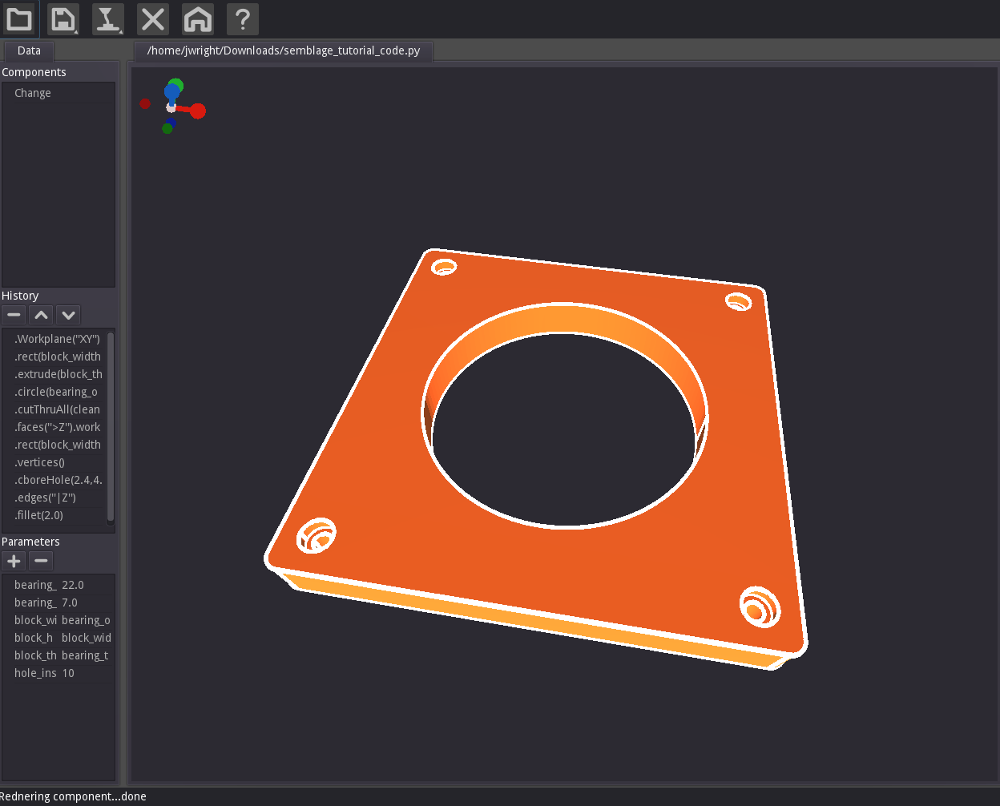

# Semblage Documentation

Welcome to the documentation for Semblage, a community-based, open source 3D CAD application that seeks to blend the mouse-driven and programmatic CAD worlds.

If you are brand new to Semblage, it is recommended that you read the [introduction page](introduction.md) to get an overview of what Semblage is before moving on to the [Installation](installation.md) and [Usage](usage.md) documentation.

If you get stuck at any point while going through this documentation, you can ask questions on any of the [communication channels](community.md#communication-channels).

***PLEASE NOTE:*** Semblage is in alpha, and so significant bugs may be present. Please open a [GitHub issue](https://github.com/7BIndustries/Semblage/issues) or post a message on the [community channels](community.md#communication-channels) if you encounter a bug.

An offline version of this documentation can be downloaded by going to the documentation [releases page](https://github.com/7BIndustries/semblage-docs/releases) and downloading the semblage-docs.zip asset for the version that matches your version of Semblage. This offline documentation can be copied to a USB drive or SD card to be portable to locations where Internet connectivity is unstable or non-existent. To use the offline documentation, extract the semblage-docs.zip archive and open the index.html file in a web browser on your local system. Pressing Ctrl+O or clicking File->Open will normally bring up the dialog to open a file in most web browsers. The index.html file will be in the root directory that was extracted. The only thing that will not work is the search box because the documentation must be hosted online for that to work. Depending on how your web browser works, it may be necessary to click an extra time on the index.html link after clicking a hyperlink in the documentation to follow it.

## Supporting

If you would like to financially support the development of this project, you can do so on [Patreon](https://www.patreon.com/jmwright) or [Librapay](https://liberapay.com/jmwright/).

## Contents

This documentation is organized into the following sections:

* [Introduction](introduction.md)
    * [Features](introduction.md#features)
    * [Goals](introduction.md#goals)
    * [Terms](introduction.md#terms)
    * [What To Expect](introduction.md#what-to-expect)
* [Installation](installation.md)
* [Usage](usage.md)
    * [User Interface](usage.md#user-interface)
    * [Operations Dialog](usage.md#operations-dialog)
        * [Common Controls](usage.md#common-controls)
        * [Sketch Controls](usage.md#sketch-controls)
    * [Mouse Controls](usage.md#mouse-controls)
    * [Workflow](usage.md#workflow)
* [Tutorials](tutorials/index.md)
    * [Bearing Block](tutorials/bearing_block.md)
* [Community](community.md)
    * [Communication Channels](community.md#communication-channels)
    * [Contributing](community.md#contributing)
    * [Coding](community.md#coding)
    * [Translating](community.md#translating)
    * [Accessibility](community.md#accessibility)
    * [Sponsoring](community.md#sponsoring)
    * [Code of Conduct](community.md#code-of-conduct)
* [Roadmap](roadmap.md)
