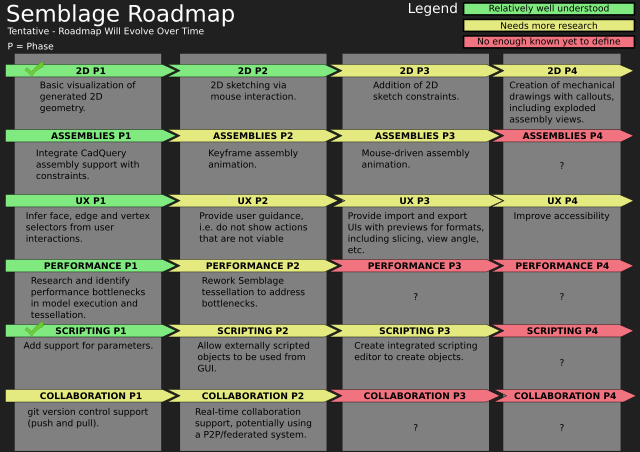

# Roadmap

Below is the proposed roadmap for this project. It represents the current plan, but can be altered based on lessons learned and feedback from the community. The diagram below shows a general order for development, with some projects being done in parallel. The _P_ character (i.e. _P1_) stands for _Phase_, and checkmark for a phase indicates that it has been completed satisfactorily.

