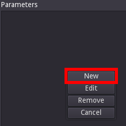
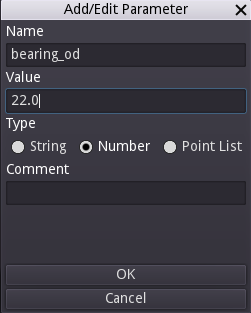
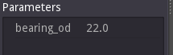
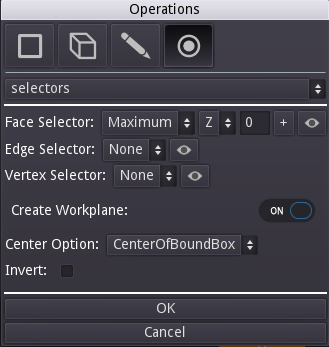
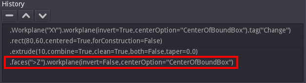
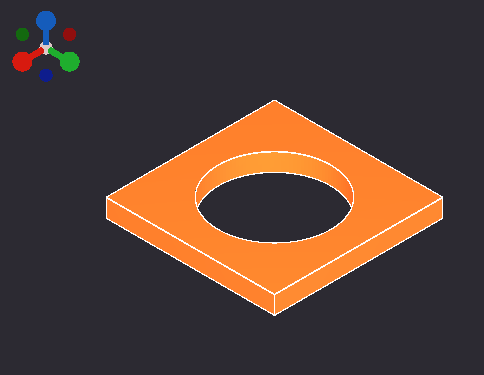
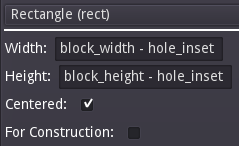
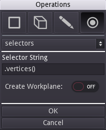

# Bearing Block Tutorial

This is a good beginner tutorial which demonstrates some of the core concepts involved in creating a component with Semblage. It covers selectors, 2D sketching, and 3D operations such as extrusion and holes. Almost all controls have built-in documentation in the form of tooltips. To see the tooltip and get more information about a control, hover over the control with the mouse cursor.

When finished, the bearing block that you create in this tutorial should look like this.

## Defining Parameters

Parameters are what make a design "parametric", and we will put some thought into what parameters our design might have. How you set up parameters is highly dependent on the situation, but in general, it is ideal to set up a few core parameters and derive all other parameters from those, if possible. We are creating a bearing block in this example and the dimension that is fixed is that of the center hole for the bearing. Assuming that we do not have to match the hole pattern on a mating part, the bearing OD (outside diameter) can drive the rest of the design.

### Step 1 - Add the Bearing OD Parameter

For the example we will design around a [608 ball bearing](https://www.mcmaster.com/608-ball-bearings/), which has a diameter of 22 mm and a thickness of 7 mm. First, add a parameter for the bearing diameter by clicking the button with the plus icon directly below the _Parameters_ label in the main window.

This will show the _Add Parameter_ dialog which has _Name_ and _Value_ fields for the new parameter. There is a blank area between the parameter _Value_ text box and the _OK_ button which will display messages if there is an error with the parameter name or value that you have chosen.

There are default placeholders in each field that must be changed. For the first parameter _Name_ enter `bearing_od` for the bearing outside diameter, and `22.0` for the _Value_. Notice that if you try to use a space in the parameter name, an error message will be displayed when you click the _OK_ button. This is because the parameter name must also be a valid Python variable name for the underlying CadQuery script to be executed correctly. The _Add Parameter_ dialog should now look like this.

Click the OK button and the parameter will be added to the _Parameters_ list in the main window.

### Step 2 - Add the Bearing Thickness Parameter

The process from step 1 of adding a parameter should be repeated for the bearing thickness, using `bearing_thickness` as the _Name_, and `7.0` as the _Value_. After clicking the _OK_ button, the Parameters list should look like this.

### Step 3 - Add Derived Parameters

Parameter values support formulas, so it is possible to base one parameter on the value of another. This makes it possible to define relationships between different aspects of a design so that the entire design (or at least most of it) updates properly when a change is made. Determining the right parameters and creating good relationships between them for an optimal design can be hard, and takes practice and experimentation.

It is possible to over-do parameterization of your models, and so care should be taken to ensure that all parameters that are created add value to the end design. In this case, we are going to add parameters to determine the dimensions of the bearing block, and the inset of the mounting hole pattern. A few more parameters could be added, but in an effort to keep this tutorial simpler are omitted.

The width and height of the bearing block will be determined by the bearing size, and how much material there should be around the bearing to support the press fit properly. We will make our bearing block square, and the bearing will be flush with the top and bottom of the plate when pushed in. To achieve this, the following parameters can be added.

| Name            | Value               | Notes                                           |
| :-------------- | :------------------ | :---------------------------------------------- |
| block_width     | bearing_od * 3.0    | 3.0 is arbitrary                                |
| block_height    | block_width         | So that height and width can be decoupled later |
| block_thickness | bearing_thickness   | Extra thickness could be added later            |
| hole_inset      | 5.0                 | Arbitrary, could be based on hole size too      |

Once finished, the _Parameters_ list should look like this.

## Base Block

With the parameters set, we can now create a simple block for the main body of the bearing block.

### Step 1 - Creating the Workplane

Right click on the 3D view to bring up the Operations dialog.

1. Make sure that the first drop down shows `Workplane`, which should be the default. Every component design starts with a base Workplane that everything else is built on.
2. The _Name_ field shows "Change". This should be set to a meaningful and concise name for the component, such as `Bearing Block`.
3. The _Orientation_ drop down sets the axes that define the workplane. For instance, _XY_ makes the workplane a plane aligned with both the X and Y axes. `XY` is a safe choice for many desktop manufacturing uses because the bed of a 3D printer or CNC router is typically defined as the X and Y axes, and the print head is the Z or "up" axis. We will build the bearing plate "up" the Z axis, much like a 3D printer would print it.
4. _Center Option_ - This option can get a little complicated, but for now the default of `CenterOfBoundBox` will work fine. This defines the center of the workplane as being the geometric center of the component. The other center options have nuances that we won't cover here.
5. _Invert_ - This defines whether the normal, or "up", direction from the workplane is in a positive or negative direction. The default is unchecked, which works well for our purposes and means that the normal will be in the positive direction.
6. _Advanced_ - This button shows another set of controls that allow a user to define a workplane in whatever location and orientation they choose. For our purposes, this is not needed.

Once the settings are correct, click the OK button. At this point you should have a semi-transparent representation of the workplane that was just created. If you rotate the view, you will see that there is a plane representing the workplane, and a spike which represents the normal of the workplane. The normal can become important in certain operations like when doing a cut or creating a hole.

### Step 2 - Creating a 2D Sketch on the Workplane

Now that there is a workplane to place geometry on, it's time to create the 2D sketch that will become the base block. Right click to bring up the _Operations_ dialog again, and click the _2D_ button at the top (pencil icon) to select the sketch tool.

By default, the `circle` operation will be selected. In this case we want to create a `rect` (rectangle). Click on the operation dropdown at the top of the dialog that says `Circle (circle)`, find `Rectangle (rect)`, and click it. The `rect` controls should load and the dialog should look like the following.

It is time to define the attributes of the rectangle based on the parameters we set up earlier.

1. Change the _Width_ value to `block_width`. This is the width of the rectangle.
2. Change the _Height_ value to `block_height`. This is the height of the rectangle.
3. Leave _Centered_ checked. When an object is centered, it will have the origin of (0, 0) directly at its center. It is a nice way to keep your component neatly centered around the origin of the workplane.
4. Leave _For Construction_ unchecked. This option is not needed now, but will be used in a later step.

If the `rect` controls look as they do in the following screenshot, go ahead and click the _OK_ button.

At this point a 2D representation of the rectangle should be visible in the 3D view, and the rect operation will show up in the _History_ list in the left pane. The 2D rectangle sketch will be used in the next operation. Since this is the first time accessing the Python subsystem to execute the script for your component, there may be a slight delay before the component is rendered.

### Step 3 - Extrude the Rectangle

The next operation will be `extrude`. Right click on the 3D view again to bring the _Operations_ dialog back up. Click on the _3D_ button. In most cases this button will be selected by default once a workplane has been created.

Click on the operation drop down at the top of the dialog, select `Extrude (extrude)` from the list, and then set the _Distance_ to _block_thickness_ as shown below.

Below is an explanation to each of the `extrude` settings.

1. _Distance_ - The distance that the extrude operation will move through. This will determine the depth dimension of the resulting solid.
2. _Combine_ - Determines whether or not this resulting solid should be combined with other existing solids within this component.
3. _Clean_ - When set, will ask the CAD kernel to clean the resulting solid(s). By default this is checked, and can be unchecked if an extrude results in an invalid solid due to a kernel issue.
4. _Both_ - Will cause the extrude operation to move through the specified distance in both the positive and negative normal directions at the same time.
5. _Taper_ - Causes the extruded area to increase or decrease as the extrude moves over the distance. A positive taper will cause the area  to decrease and a negative taper will cause the area to increase. Keep in mind that using a taper can make it harder to determine the area of the face at the end of the extrusion.
6. _Invert_ - Checking this will cause the extrusion to move in the opposite direction from the workplane normal.

Once the extrude settings are as shown, click the _OK_ button. The result should look something like this in the main window.

## Center Hole

The center hole that the bearing presses into can now be added. To tell Semblage (and by extension CadQuery) which face to place the next feature on, we use selectors. Selectors are a flexible way to capture design intent. For instance, if we select the face in the maximum Z axis direction, the furthest face will always be selected, even if steps or other features are added to the component. Selectors help make designs less brittle.

The goal is to eventually have selectors largely determined by what the user selects prior to specifying a new selector operation, but for now the selectors have to be added manually.

### Step 1 - Select a Face to Place Circle On

The hole in the center of the block runs through the Z axis. We could choose either to start the hole from the minimum Z or maximum Z sides of the block, but starting from the maximum Z direction feels a little bit more like a drilling operation in a CNC mill, so we will do that.

Bring up the _Operations_ dialog, and make sure that the _Selectors_ button is toggled.

_Face_, _Edge_ and _Vertex_ selectors are available, but to place the circle for the hole we will only use the _Face_ selector and create a workplane on that.

1. Pull down the _Face Selector_ drop down that shows _None_ by default and set it to `Maximum`.
2. A new drop down will appear to set the axis. Set this to `Z`. This, combined with the _Maximum_ setting above, will select the face that is furthest along the Z axis away from the origin.
3. Click the _Create Workplane_ toggle to set it to _ON_. This will display extra options for adding a workplane to the selected face so that the circle can be added to that.

Your _Operations_ dialog should now look like this.

Hit _OK_ to add this selector to the main _History_ list. Again, since Semblage is in alpha there are visualizations missing, including selector and face workplane visualizations. There will be nothing shown in the 3D view for edges and vertices at this time, but a thin slice representing the selected face selector may be shown. However, even if nothing shows in the 3D view, the face selector will still show up in the _History_ list.

### Step 2 - Add the Hole Circle

Now that the "top" face of the block has been selected, we can place a circle the size of the center hole on it and cut it through the block. We could also add a 3D hole operation, but the idea with this tutorial is to follow the workflow of `2D sketch -> 3D operation`. As you gain more experience with Semblage and CadQuery, you will start to use orders of operations that feel right for you in a given situation, even if they deviate from this standard workflow.

Bring up the _Operations_ dialog (right click), and follow these steps.

1. Click the 2D sketch mode button
2. The `circle` operation should be shown by default, but if it is not, click the operation drop down and select it
3. Set the value of _Radius_ to `bearing_od`, which is the parameter we set before.
4. Leave _For Construction_ unchecked

The `circle` controls in the dialog should now look like this (the parameter name is truncated in the screenshot).

Note that in most cases a press-fit tolerance would be added to the hole to make sure the bearing fit correctly. To keep things a little simpler, we have omitted that here.

Click the _OK_ button to add the circle to the _History_ list. The circle will be displayed in the 3D view at this point, but the original box will not be. Displaying additions in the context of the operations that have been performed before will be a future visualization update.

### Step 3 - Add the Cut Operation

With the circle placed, a cut operation can now be added. Open the Operations dialog with a right click again, and perform the following steps.

1. Click the _3D_ button to select the group of 3D operations.
2. Click the operation drop down and select `Thru Cut (cutThruAll)` from the list. We do a thru cut because if we created a blind cut with a distance, and then changed the thickness of the plate, the hole might not go all the way through the plate anymore. Using `cutThruAll` ensures that our design intent is preserved, even when the component changes.
3. All of the default `cutThruAll` options are what we need for this. If you need a tapered hole, the _Taper_ option could be used. The _Invert_ setting will cause the hole to be cut in the opposite direction. Neither of those things are needed in this case.

The _Operations_ dialog should now look like the following.

Click the _OK_ button if/when all settings match the screenshot. This adds the `cutThruAll` operation to the main _History_ list and a representation of the component is shown in the 3D view.

## Counter-bore Mounting Holes

We now want to place counter-bore holes in each of the 4 corners of the block. We are going to place another rectangle on the maximum Z ("top") surface of the block, but this time we are going to make it construction geometry. This type of geometry is only used for placing other geometry and features, not for being converted into a solid by a 3D operation.

### Step 1 - Set Location of Construction Geometry

We need to select the face that the construction geometry will be placed on. As with the center hole, mimicking a machining operation and starting from the maximum "top" Z surface can be a good default. Right click to bring up the _Operations_ dialog, then follow these steps.

1. Click the _Selectors_ mode button.
2. Click on the _Face Selector_ drop down and select `Maximum`. This will select the face furthest away from the origin in the axis we select next.
3. A new drop down will appear for setting the axis. Set this to `Z`.
4. Click the Create Workplane toggle to set it to ON. This will display extra options for adding a workplane to the selected face so that the circle can be added to that.

The _Operations dialog settings should now look like the following.

Click the _OK_ button to add the selector to the main _History_ list. Nothing will be rendered, but selection visualization is planned for the future and will address this issue.

### Step 2 - Add Construction Rectangle

Next we will add the rectangle that will be used to place the holes. Right click to bring the `Operations` dialog back up, then follow these steps.

1. Click the _Sketch_ mode button to select the group of 2D operation controls.
2. Click the operation drop down and select `Rectangle (rect)`.
3. Set the _Width_ value to `block_width - hole_inset`, which insets the rectangle from the edge of the block along the width dimension.
4. Set the _Height_ value to `block_height - hole_inset`, which insets the rectangle from the edge of the block along the height dimension.
5. Leave _Centered_ checked. We centered the rectangle that was used to build the base block, and so we want to center this one as well.
6. Check the box next to _For Construction_. This is what determines that the rectangle will only be used to place other geometry and locate other options.

The `rect` controls should now look like the following screenshot.

Click the _OK_ button to add the construction rectangle to the main _History_ list.

### Step 4 - Select Rectangle Vertices to Place Holes

With the construction rectangle now available, we can select the vertices in each of the 4 corners and use those to place the counter-bore holes. Bring up the _Operations_ dialog again and follow these steps.

1. Click the _Selectors_ mode button.
2. Click on the _Vertex Selector_ drop down and select `All`. This will select all the vertices of the construction rectangle, which effectively selects all the corners.
3. Leave the _Create Workplane_ toggle on _OFF_.

The _Operations_ dialog should now look like this.

Click _OK_ to add the selector to the main _History_ list. Nothing will be displayed at this time since selector visualizations have not been implemented.

### Step 3 - Add Counter-Bore Holes

With the construction rectangle vertices selected, we can use those to place the counter-bore holes. Bring up the _Operations_ dialog again and follow these steps.

1. Make sure that 3D mode is selected.
2. Click the operation drop down and select `Counter-Bore Hole (cboreHole)`.
3. Set _Hole Diameter_ to `2.4`.
4. Leave _Hole Depth_ at `0` for thru.
5. Set _Counter-Bore Diameter_ to `4.4`.
6. Set _Counter-Bore Depth_ to `2.1`.
7. Leave _Clean_ checked.

The _Operations_ dialog should now look like this.

Click the _OK_ button to add the counter-bore holes to the block. The bearing block should now look like the following.

## Adjust A Parameter

Notice that the counter-bore holes are too close to the edge of the block. This is easy to fix since we tied the hole positions to the `hole_inset` parameter. Follow these steps to update the hole locations.

1. Double click the `hole_inset` parameter in the _Parameters_ list.

Double clicking the parameter will bring up the parameter dialog. Note that it is not possible to edit the parameter name in this dialog. For that, you must delete and recreate the parameter.

2.Change the `hole_inset` parameter to 10. The parameter dialog should now look like this.

Click the _OK_ button to update the parameter and re-render the bearing block. The block should now look like this.

## Fillet Edges

The last thing to do is to break the edges on the block with fillets. We only want to fillet the edges that are parallel to the Z axis, so will use a new selector for those.

### Step 1 - Select the Edges

Open the _Operations_ dialog and follow these steps.

1. Click the _Selectors_ mode button.
2. Click the _Edge Selector_ drop down that shows `None`, and select `Parallel`. The parallel selector selects any edges that are parallel to a given axis.
3. Once the _Parallel_ selector has been clicked, a new drop down will become visible. We want to select the edges parallel to the Z axis, so select `Z` in this new drop down.

The _Operations_ dialog should now look like this.

Click the _OK_ button to add the edge selector to the main _History_ list. Nothing will be shown at this point.

### Step 2 - Apply the Fillets

The last thing to do is to fillet the edges that have been selected. Open the _Operations_ dialog and follow these steps.

1. Click the _3D_ mode button.
2. Click the operation drop down and select `Fillet (fillet)`.
3. There is only one setting for the fillet command, and that is _Radius_. Set that to `2.0`.

The dialog should look like this now.

Click the _OK_ button to add the fillet to the main _History_ list. The final bearing block should render and look like this.

## Extra Credit

There are other things that can be done with this bearing block, and improvements are left as an exercise for the reader. Here are some ideas.

* Change the counter-bore hole inset based on bolt size.
* Add a boss for the bearing to press into instead of having it be flush with the plate.
* Change the `block_width` and `block_height` parameters to round to the nearest 10 to keep dimensions nice and even. Keep in mind that underneath everything, Semblage is just executing a Python script, and so all the rules that apply to Python can apply to your parameters (which are just Python variables).
