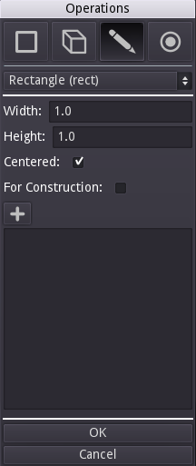
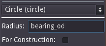
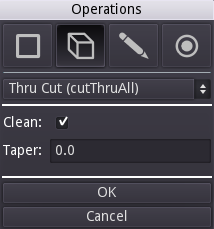
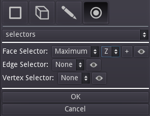
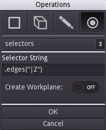
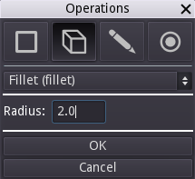
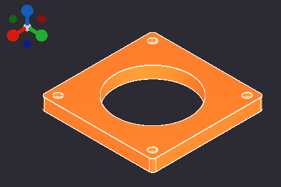

# Bearing Block Tutorial

This is a good starter tutorial which demonstrates some of the core concepts of creating a component with Semblage. It covers selectors, 2D sketching, and 3D operations such as extrusion and holes.

## Base Block

First, create a simple block for the main body of the bearing block.

### Step 1 - Creating the Workplane

Right click on the 3D view to bring up the Operations dialog.

1. Make sure that the first drop down shows `Workplane`, which should be the default. Every component design starts with a base Workplane that everything else is built on.
2. The _Name_ field shows "Change". This should be set to a meaningful and concise name for the component, such as "Bearing Block".
3. The _Orientation_ drop down sets the axes that define the workplane. For instance, _XY_ make the workplane a plane oriented with both the X and Y axes. _XY_ is a safe choice for many desktop manufacturing uses because the bed of a 3D printer or CNC router being in the X and Y axes, and the print head being the Z or "up" axis. We will build the bearing plate "up" the Z axis, much like a 3D printer would print it.
4. _Center Option_ - This option can get a little complicated, but for now the default of _CenterOfBoundBox_ will work fine. This defines the center of the workplane as being the geometric center of the component. The other center options have nuances that we won't cover here.
5. _Invert_ - This defines whether the normal or "up" direction from the workplane is in a positive or negative direction. The default is unchecked, which works well for our purposes and means that the normal will be in a positive direction.
6. _Advanced_ - This button shows another set of controls that allow a user to define a workplane in whatever location and orientation they choose. For our purposes, this is not needed.

Once the settings are correct, click the OK button. Since this is the first time we have added an operation, there may be some delay as the Python subsystem starts up. At this point you should have a semi-transparent representation of the workplane that was just created. If you rotate the view, you will see that there is a plane representing the workplane, and a spike which represents the normal of the workplane. The normal can become important in certain operations like when doing a cut or creating a hole.

### Step 2 - Creating a 2D Sketch on the Workplane

Now that there is a workplane to place geometry on, it's time to create the 2D sketch that will become the base block. Right click to bring up the _Operations_ dialog again, and click the _2D_ button at the top (pencil icon) to select the sketch tool.

By default, the `circle` operation will be selected. In this case we want to create a `rect` (rectangle). Click on the operation dropdown at the top of the dialog that says `circle`, find `rect`, and click it. The `rect` controls should load and the dialog should look like the following.

It is time to define the attributes of the rectangle.

1. Change the _Width_ value to _80.0_. This is the width of the rectangle.
2. Change the _Height_ value to _60.0_. This is the height of the rectangle.
3. Leave _Centered_ checked. When an object is centered, it will have the origin of (0, 0) directly at its center. It is a nice way to keep your component neatly centered.
4. Leave _For Construction_ unchecked. This option is not needed now, but will be used in a later step.
5. _Selectors_ are a very important topic that we will cover when we use them to start placing features on the block.
6. _Operation_ We are going to extrude the rectangle into a solid block in a separate step, but you can use this drop down menu as a shortcut to add the 3D operation. For now we are going to keep things simple.

If the `rect` controls look as they do in the following screenshot, go ahead and click the _OK_ button.

Since Semblage is in alpha some features are missing, and on of those features is 2D visualization in the 3D view. This will make it so that nothing is rendered in the 3D view, although the 2D operation shows up in the _History_ list in the left pane. The 2D sketch is there, and will be used in future operations.

### Step 3 - Extrude the Rectangle

The next operation will be `extrude`. Right click on the 3D view again to bring the _Operations_ dialog back up. Click on the _3D_ button. In most cases this button will be selected by default once a workplane has been created.

Click on the operation drop down at the top of the dialog, select `extrude` from the list, and then set the _Distance_ to _10_ as shown below.

Below is an explanation to each of the `extrude` settings.

1. _Distance_ - The distance that the extrude operation will move through. This will determine the depth dimension of the resulting solid.
2. _Combine_ - Determines whether or not this resulting solid should be combined with other existing solids within this component.
3. _Clean_ - When set, will ask the CAD kernel to clean the resulting solid(s). By default this is checked, and can be unchecked if an extrude results in an invalid solid due to a kernel issue.
4. _Both_ - Will cause the extrude operation to move through the specified distance in both the positive and negative directions at the same time.
5. _Taper_ - Causes the extruded area to increase or decrease as the extrude moves over the distance. A positive taper will cause the area  to decrease and a negative taper will cause the area to increase. Keep in mind that using a taper can make it harder to determine the area of the face at the end of the extrusion.
6. _Invert_ - Checking this will cause the extrusion to move in the opposite direction from the workplane normal.

Once the extrude settings are as shown, click the _OK_ button. The result should look something like this in the main window.

## Center Hole

The center hole that the bearing presses into can now be added. To tell CadQuery which face to place the next feature on, we use selectors. Selectors are a flexible way to capture design intent. For instance, if we select the face in the maximum Z axis direction, the furthest face will always be selected, even if steps or other features are added to the component. It makes designs less brittle.

The goal is to eventually have selectors largely determined by what the user selects prior to adding a new operation, but for now the selectors have to be added manually. To add the selector, bring up the Operations dialog (right click) and click the selector button (a dot with a circle around it).

### Step 1 - Select a Face to Place Circle On

The hole in the center of the block runs through the Z axis. We could choose either to start the hole from the minimum Z or maximum Z sides of the block, but starting from the maximum Z direction feels a little bit more like a drill operation, so we will do that.

Bring up the _Operations_ dialog, and make sure that the _Selectors_ button is toggled.

_Face_, _Edge_ and _Vertex_ selectors are available, but to place the circle for the hole we will only use the _Face_ selector.

1. Pull down the _Face Selector_ drop down that shows _None_ by default and set it to _Maximum_.
2. A new drop down will appear to set the axis. Set this to _Z_. This, combined with the _Maximum_ setting above, will select the face that is furthest along the Z axis away from the origin.

Your _Operations_ dialog should now look like this.

Hit _OK_ to add this selector to the main _History_ list. Again, since Semblage is in alpha there are visualizations missing, including selector visualizations. There will be nothing shown in the 3D view for edges and vertices at this time, and a thin slice representing a face selector will be shown. However, even if nothing shows in the 3D view, the face selector will show in the _History_ list.

### Step 2 - Add the Hole Circle

Now that the "top" face of the block has been selected, we can place a circle the size of the center hole on it and cut it through the block. We could also add a 3D hole operation, but the idea with this tutorial it to follow the workflow of `2D sketch -> 3D operation`. As you gain more experience with Semblage and CadQuery, you will start to use orders of operations that feel right for you in a given situation.

Bring up the _Operations_ dialog, and follow these steps.

1. Click the 2D sketch mode button
2. The `circle` operation should be shown by default, but if it is not, click the operation drop down and select it
3. Set the value of _Radius_ to _11_
4. Leave _For Construction_ unchecked

The _Operations_ dialog should now look like this.

Click the _OK_ button to add the circle to the _History_ list. Nothing will be displayed in the 3D view at this point since 2D visualization is not available yet.

### Step 3 - Add the Cut Operation

With the circle placed, a cut operation can now be added. Open the Operations dialog with a right click again, and perform the following steps.

1. Click the _3D_ button to select the group of 3D operations.
2. Click the operation drop down and select `cutThruAll` from the list. We do a thru cut because if we created a blind cut with a distance, and then changed the thickness of the plate, the hole might not go all the way through the plate anymore. Using `cutThruAll` ensures that our design intent is preserved, even when the component changes.
3. All of the default `cutThruAll` options are what we need for this. If you need a tapered hole, the _Taper_ option could be used. The _Invert_ setting will cause the hole to be cut in the opposite direction. Neither of those things are needed in this case.

The _Operations_ dialog should now look like the following.

Click the _OK_ button if/when all settings match the screenshot. This adds the `cutThruAll` operation to the main _History_ list and a representation of the component is shown in the 3D view.

## Counter-bore Mounting Holes

We want to place counter-bore holes in each of the 4 corners of the block. The method shown here is a basic method that will be less than ideal until variables are added in Semblage. This method will not adjust the hole locations if the width and depth of the plate are changed. There is an alternative method given at the end of this tutorial, but it is more advanced and requires more steps.

We are going to place another rectangle on the maximum Z surface ("top" surface) of the block, but this time we are going to make it construction geometry. This type of geometry is only used for placing other geometry and features, not for being converted into a solid by a 3D operation.

### Step 1 - Set Location of Construction Geometry

We need to select the face that the construction geometry will be placed on. As with the center hole, mimicking a machining operation and starting from the maximum "top" Z surface can be a good default. Right click to bring up the `Operations` dialog, then follow these steps.

1. Click the _Selectors_ mode button.
2. Click on the _Face Selector_ drop down and select _Maximum_. This will select the face furthest away from the origin in the axis we select next.
3. A new drop down will appear for setting the axis. Set this to _Z_.

The _Operations dialog settings should now look like the following.

Click the _OK_ button to add the selector to the main _History_ list.

### Step 2 - Add Construction Rectangle

Right click to bring the `Operations` dialog back up, then follow these steps.

1. Click the _Sketch_ mode button to select the group of 2D operation controls.
2. Click the operation drop down and select `rect`.
3. Set the _Width_ value to _68.0_, which is an inset of _12.0_ from the side of the block.
4. Set the _Height_ value to _48.0_, which is an inset of _12.0_ from the side of the block.
5. Leave _Centered_ checked. We centered the rectangle that was used to build the base block, and so we want to center this one as well.
6. Check the box next to _For Construction_. This is what determines that the rectangle will only be used to place other geometry and locate other options.

The _Operations_ dialog should now look like the following screenshot.

Click the _OK_ button to add the construction rectangle to the main _History_ list.

### Step 4 - Select Rectangle Vertices to Place Holes

With the construction rectangle now available, we can select the vertices in each of the 4 corners and use those to place the counter-bore holes. Bring up the _Operations_ dialog again and follow these steps.

1. Click the _Selectors_ mode button.
2. Click on the _Vertex Selector_ drop down and select _All_. This will select all the vertices of the construction rectangle, which effectively selects all the corners.

The _Operations_ dialog should now look like this.

Click _OK_ to add the selector to the main _History_ list.

### Step 3 - Add Counter-Bore Holes

With the construction rectangle vertices now selected, we can use those to place the counter-bore holes. Bring up the _Operations_ dialog again and follow these steps.

1. Make sure that 3D mode is selected.
2. Click the operation drop down and select `cboreHole`.
3. Set _Hole Diameter_ to _2.4_.
4. Leave _Hole Depth_ at _0_ for thru.
5. Set _Counter-Bore Diameter_ to _4.4_.
6. Set _Counter-Bore Depth_ to _2.1_.
7. Leave _Clean_ checked.

The _Operations_ dialog should now look like this.

Click the _OK_ button to add the counter-bore holes to the block. The bearing block should now look like the following.

## Fillet Edges

The last thing to do is to break the edges on the block with fillets. We only want to fillet the edges that are parallel to the Z axis, so will use a new selector for those.

### Step 1 - Select the Edges

Open the _Operations_ dialog and follow these steps.

1. Click the _Selectors_ mode button.
2. Click the _Edge Selector_ drop down that shows _None_, and select _Parallel_. The parallel selector selects any edges that are parallel to a given axis.
3. Once the _Parallel_ selector has been clicked, a new drop down will become visible. We want to select the edges parallel to the Z axis, so select _Z_ in this new drop down.

The _Operations_ dialog should now look like this.

Click the _OK_ button to add the edge selector to the main _History_ list.

### Step 2 - Apply the Fillets

The last thing to do is to fillet the edges that have been selected. Open the _Operations_ dialog and follow these steps.

1. Click the _3D_ mode button.
2. Click the operation drop down and select _fillet_.
3. There is only one setting for the fillet command, and that is _Radius_. Set that to _2.0_.

The dialog should look like this now.

Click the _OK_ button to add the fillet to the main _History_ list. The final bearing block should render and look like this.

