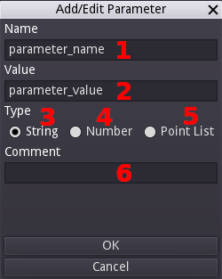

# Usage

## User Interface

Semblage's user interface has several parts, and learning where they are and what they do will be important when starting with Semblage. The user interface is kept intentionally simple, and an effort will be made to keep it simple over time as more features are added. In most cases, hovering the mouse cursor over a control will show a tooltip with additional information about what the control does.

Below is a diagram showing the main sections of the user interface.

1. _Open Button_ - Allows a user to open a Semblage component file, which is just a carefully structured CadQuery script. Semblage files are structured in a way that preserves the history, which is the order that operations were added in. Opening a non-Semblage CadQuery file may still work, but is not officially supported at this time, and no history will be loaded. It should be understood that Semblage is not a CadQuery IDE. There are other editors like [CQ-editor](https://github.com/CadQuery/CQ-editor) that can fill that role better than Semblage.
2. _Save Button_ - Any button with a triangle in the bottom-right corner will open a submenu. The Save button gives two options: _Save_ and _Save As_. If a component has not been saved yet, clicking the _Save_ item will trigger a _Save As_, which allows the path and file name to be set for the component. After the file name has been set, clicking _Save_ will simply save the component to the existing file. The _Ctrl+S_ hotkey combination will trigger a save as well.
3. _Export Button_ - Also referred to as the "Make Button", the icon for this button is a 3D printer hotend which is extruding plastic. Clicking this button will display a submenu with a listing of each format that the component can be exported to. Clicking on one of the items will open the export dialog for that format.
4. _Close Button_ - Clicking this button closes the current component and clears the UI so that work on a new component can be started.
5. _Home Button_ - Clicking this button with a component loaded into the 3D view will return the camera view to a standard "home" position. This gives a safe spot to come back to when rotating, panning, and zooming an object.
6. _Information Button_ - This button opens an About dialog that contains acknowledgements, documentation links, and version information.
7. Data - Sidebar that contains the list of _Components_ with the operation _History_ of the associated component, and any _Parameters_ that are associated with the current component. Parameters are global and are not scoped to any single component within the enclosing component script.
8. _Components_ - List of current components. Each component will contain all of the operations that have been added to it as children in the tree. Multiple components can be added and used in combination to perform operations such as sweep. Right clicking on a component gives a menu that allows a user to _Add_, _Edit_, _Remove_ or _Show/Hide_ the component. Right clicking on an operation item shows a menu that allows a user to _Add_, _Edit_ and _Remove_ the operation, and there is also an item (_Insert Above_) that will allow an operation to be inserted above the operation that was right clicked on. Operation items can also be dragged and dropped onto one another to reorder the operations.
9. _Parameters_ - Parameters are what make a model "parametric", and this control holds any parameters that are defined for the current component. These parameters are global to the component script, and are not scoped to an individual component within the script/file. Right clicking in the empty space will give the user the option to add a _New_ parameter, which will open the _Add/Edit Parameter_ dialog. Once a parameter has been added, right clicking on it will enable the user to _Edit_ or _Remove_ that parameter. Double clicking an entry in this list also allows that entry to be edited, although the name of a parameter cannot be changed once it has been created. To change the name, the parameter must be deleted and recreated. Parameters can be dragged and dropped on top of each other to reorder them.
10. _Status Indicator_ - Used to keep the user updated on what the UI is doing. Examples are _Ready_ for when the interface is fully loaded and ready to use, _Rendering..._ for when a component is being recomputed and prepared for display, and _Component saved_ to indicate that a save operation completed.
11. _Document Tab_ - Displays the path and name of the currently open component. Displays _Start_ when the UI first loads.
12. _Rotation Indicator_ - Shows the X (red), Y (green) and Z (blue) axes and their orientation. This indicator mirrors the rotation applied to the 3D view. In the future the indicator ball for each axis will be labelled with its axis letter, and clicking on a ball will snap the 3D view to that orientation. This is very similar to the way this indicator works in Blender.
13. _3D View_ - The 3D render of the component is displayed in this view. 2D geometry such as edges are also rendered into this 3D view. The [mouse controls](#mouse-controls) outlined below can be used to rotate, pan and zoom the 3D view.

## Add/Edit Parameter Dialog

Right clicking on the _Parameters_ list (#9 above) will allow a user to click _New_ to create a new Parameter. Alternatively, the user can click the _Edit_ button to edit an existing parameter. Either one will cause the _Add/Edit Parameter_ dialog to be displayed.

The layout of the _Add/Edit Parameter_ dialog is shown below.

1. _Name_ - Name of the parameter. It must not be the same as an existing parameter, cannot start with a number, and can contain only numbers, letters, and the underscore character. These rules exist so that the parameter name can be used as a variable name in the CadQuery script.
2. _String_ - Select this to specify that the parameter is to be a string (text) parameter.
3. _Number_ - Select this to specify that the parameter is to be an integer (i.e. _1_) or a float (i.e. _1.0_).
4. _Point list_ - Select this to specify a list of XYZ points, which are used for things like polylines and splines. Selecting this will replace the _Value_ field (#5) with a table control that allows setting the points. Right clicking on the table will display a menu that will allow the user to _Add_ or _Remove_ points from the table. _Remove_ will delete the currently selected row. The points in the table can be edited directly, as with a spreadsheet application.
5. _Value_ - Sets the value of this parameter. It can be text/string, number, or a point list. This field does support equations for the Number which can reference other (already existing) parameters.
6. _Comment_ - Description of the parameter that will travel with the component file. Use this to inform end users why the parameter exists and what it is used for.

Once the parameter information has been entered, clicking the _OK_ button will add the parameter to the _Parameters_ list in the main user interface.

## Operations Dialog

Right clicking anywhere on the 3D view will display the _Operations_ dialog. This dialog can also be displayed by right clicking on the Components tree and then clicking the _Add_ button. This is where the majority of the work of creating a component is done. Displaying the dialog on a right click within the 3D view gives fast access to component creation operations, and prepares the user for when features such as vertices, edges, faces can be selected and used in an operation. There are four group buttons at the top of the dialog, which select groups of operations that this dialog can operate with. The diagram below highlights each button and which group of operations it selects.

1. _Component/Workplane_ - Used to create a new components (which is a CadQuery Workplane object underneath), add a construction workplane, or modify the existing component's workplane with operations such as `rotate` and `translate`.
2. _3D_ - Collection of 3D operations, typically used with a previous 2D operation to create or modify a component.
3. _2D_ - Collection of 2D operations that can be used alone, or in conjunction with a 3D operation later.
4. _Selectors_ - Selectors are very important in both CadQuery and Semblage, and are used to select faces, edges and vertices in a way that captures design intent and makes designs more robust in most cases.

### Common Controls

Besides the mode buttons, there are a few controls that are always available on the operations dialog. Those controls are outlined below.

1. _Operations Drop Down_ - Allows the user to select which operation to apply to the component next. By default, the operation that is shown when creating the first new component is _New Component_, which must be created in order to apply any other operations. Changing this drop down will change which controls are displayed in the middle section of the dialog, above the _OK_ and _Cancel_ buttons.
2. _OK Button_ - Once all control values for the selected operation have been set, clicking this button will close the dialog and add the operation under the currently selected component in the Components tree. It will then trigger a render of the resulting component.
3. _Cancel Button_ - Can be used if it is decided that an operation should not be applied to the component.

### Sketch Controls

When in 2D mode, two controls will be added to the dialog. These extra controls allow the user to group related 2D operations together into a single sketch operation entry. At some point this manual addition of 2D operations will be reworked into a mouse-driven sketch tool with 2D constraints. The sketch controls are outlined below.

1. _Add Button_ - Clicking this button adds the currently selected operation, configured with the current settings, to the operations list that is discussed next.
2. _Operations List_ - This holds each of the 2D operations that have been added by the user. Double-clicking on an entry will load its information into the controls above so that it can be edited (editing is discussed in an upcoming section).

Once a 2D operation has been added to the operations list and is selected, a set of new buttons becomes available which allow the user to modify the sketch operations and their order. Each of those additional buttons are outlined below.

1. _Re-Render_ (arrow circle) - After changing the order of 2D operations, clicking this will refresh the operations and their order.
2. _Remove_ (minus) - Clicking this will remove the currently selected 2D sketch operation.
3. _Move Up_ (up arrow) - Moves the selected 2D sketch operation up towards the top of the list.
4. _Move Down_ (down arrow) - Moves the selected 2D sketch operation down towards the bottom of the list.
5. _Selected_ - Example of a 2D sketch operation highlighted after being selected.

## Mouse Controls

Mouse controls are not configurable at this time, but likely will be in the future.

* _Left Mouse Button_ - Rotate the camera around the component in the 3D view.
* _Mouse Wheel_ - Zoom in and out.
* _Middle Mouse Button_ - Pan the component side to side.
* _Right Mouse Button_ - Open the Operations dialog.

## Workflow

Semblage is designed to use the following general process for creating components.

1. Create a component
2. Create a 2D sketch on the component's base workplane (i.e. lines, arcs)
3. Perform a 3D operation on the 2D sketch (i.e. extrude)

There are variations on this theme, such as when a user only wants to create a 2D sketch to export it to DXF or SVG, or when the user wants to create sketches in two orthogonal component workplanes to do a sweep operation. In general however, this will be the central workflow for most uses.

Now that you are familiar with the user interface and basic usage of Sembalge, the [Tutorials](tutorials/index.md) are useful for learning the workflow and modelling techniques in more depth.
